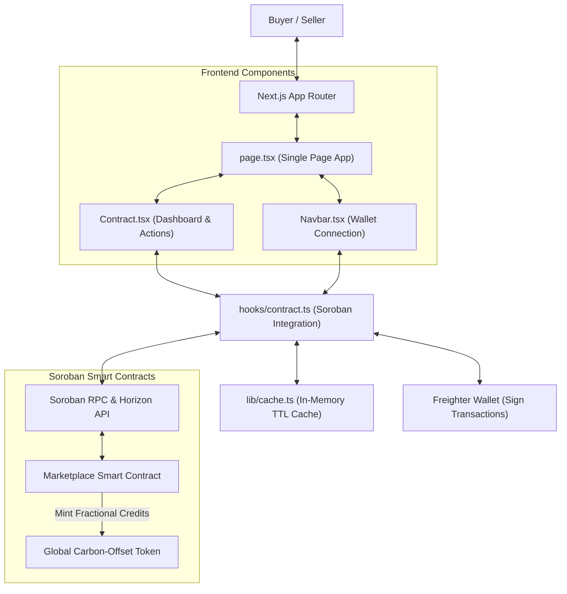
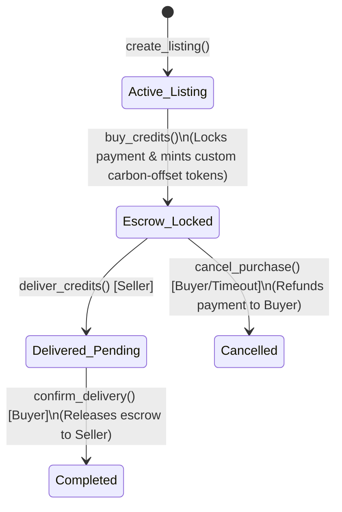

<h1 align="center">🍃 Carbon Credit Marketplace 🔗</h1>

<p align="center">
  <strong>A Decentralized, Permissionless Carbon Credit Marketplace built on the Stellar network using Soroban smart contracts.</strong>
</p>

<p align="center">
  <a href="https://carbon-credit-marketplace-sage.vercel.app/" target="_blank">
    
  </a>
</p>

<p align="center">
  <a href="https://github.com/drishyam27/carbon_credit_marketplace/actions/workflows/ci.yml" target="_blank">
    
  </a>
</p>

<p align="center">
  <a href="#overview">Overview</a> •
  <a href="#tech-stack">Tech Stack</a> •
  <a href="#architecture">Architecture</a> •
  <a href="#development">Development</a> •
  <a href="#deployment-guide">Deployment Guide</a> •
  <a href="#screenshots">Screenshots</a>
</p>

---

* **GitHub Repository:** [drishyam27/carbon_credit_marketplace](https://github.com/drishyam27/carbon_credit_marketplace)
* **Walkthrough Demo Video:** [https://github.com/user-attachments/assets/a7ccc55f-41b7-4e21-9e06-8af8d8da75da](https://github.com/user-attachments/assets/a7ccc55f-41b7-4e21-9e06-8af8d8da75da)

> [!IMPORTANT]
> ### 📊 User Interaction & Feedback Proof (Google Sheet & Form)
> **[👉 Click Here to Fill out the User Feedback Form 👈](https://docs.google.com/forms/d/e/YOUR_GOOGLE_FORM_ID/viewform?usp=sf_link)**
> 
> **[👉 Click Here to View Live Google Spreadsheet of User Responses 👈](https://docs.google.com/spreadsheets/d/YOUR_GOOGLE_SHEET_ID/edit?usp=sharing)**
> 
> *Contains real-world feedback ratings (1-5), constructive suggestions, onboarded user Stellar public keys, and verified testnet transaction hashes showing listing creations, credit purchases, delivery updates, and escrow confirmations.*

> [!TIP]
> ### 📈 Vercel Web Analytics Integration
> The live application integrates **Vercel Analytics** to track real-time visitor insights, page views, and user engagement, ensuring seamless monitoring of the platform's adoption and growth.

---

## 📌 Table of Contents

* [1. Product Overview & Problem Statement](#overview)
  * [The Problem](#the-problem)
  * [The Carbon Credit Solution](#the-solution)
* [2. Technical Stack](#tech-stack)
* [3. Directory Structure](#directory-structure)
* [4. Technical Architecture & Component Flow](#architecture)
  * [1. System Component Architecture](#component-architecture)
  * [2. Escrow Campaign Lifecycle State Transitions](#state-transitions)
  * [3. Inter-Component Communication Flow](#communication-flow)
* [5. Smart Contract Design](#contract-design)
  * [Access Control & Custom Token Minting](#access-control)
  * [Escrow Settlement Mechanics](#escrow-mechanics)
* [6. Local Development & Testing](#development)
  * [Prerequisites](#prerequisites)
  * [Compilation & Testing](#compilation-testing)
  * [Frontend Development](#frontend-dev)
* [7. Stellar Testnet Deployment Guide](#deployment-guide)
  * [Step 1: Configure Deployer Identity](#deployer-identity)
  * [Step 2: Compile WASM Bytecodes](#compile-wasm)
  * [Step 3: Deploy & Initialize Marketplace Contract](#deploy-contract)
  * [Step 4: Configure Frontend](#configure-frontend)
* [8. Deployed Contract Addresses & Verification](#verification)
* [9. Caching Strategy](#caching-strategy)
* [10. Project Media & Screenshots](#screenshots)

---

<a name="overview"></a>
## 🔍 1. Product Overview & Problem Statement

<a name="the-problem"></a>
### The Problem
Traditional carbon offset markets suffer from significant transparency, efficiency, and accessibility issues:
1. **Lack of Transparency & Double Counting:** Tracking carbon credits across different registry databases is fragmented, resulting in double‑selling and untraceable claims.
2. **High Intermediary Fees:** Centralized carbon brokers charge massive commissions to list, inspect, and complete carbon offset projects.
3. **Rigid Purchase Requirements:** Smaller companies and retail users cannot participate easily because minimum transaction sizes block fractional trading.
4. **Counterparty Risk:** Buyers must pay upfront before verification and delivery occur, exposing them to default or fraudulent offset claims.

<a name="the-solution"></a>
### The Carbon Credit Solution
The **Carbon Credit Marketplace** resolves these inefficiencies using Stellar Soroban smart contracts:
* **Fully Permissionless Listing:** There are no admin gates or listing approvals. Anyone can list a verified carbon offset project.
* **Smart Escrow Contracts:** On purchase, buyer funds are securely locked in the contract. Payment is only released to the seller once the buyer confirms delivery.
* **Fractional Token Distribution:** Buyers can purchase any custom amount of credits. The contract automatically mints and issues fractional carbon-offset tokens representing their ownership slice.
* **Built-in Dispute Redirection:** If a dispute arises, purchase cancellation and refund options restore funds back to the user.

---

<a name="tech-stack"></a>
## 🛠️ 2. Technical Stack

* **Smart Contracts:** Rust, Soroban SDK (v21.0.0+)
* **Frontend:** Next.js 16 (App Router), React 19, TypeScript, Tailwind CSS 4
* **State Management & Caching:** Custom in-memory TTL caching engine to optimize RPC query requests
* **Wallet Connection:** Freighter Wallet (Stellar integration)
* **Testing:** Vitest (Frontend suite) & Cargo test (Rust Smart Contract tests)
* **CI/CD Pipeline:** GitHub Actions

---

<a name="directory-structure"></a>
## 📂 3. Directory Structure

The project separates the smart contract development workspace from the Next.js frontend application client:

```
carbon_credit_marketplace/
├── .github/
│   └── workflows/
│       └── ci.yml                # GitHub Actions CI/CD pipeline
├── client/                       # Next.js frontend app
│   ├── __tests__/                # Vitest testing suite
│   │   ├── cache.test.ts         # Cache utility unit tests
│   │   ├── components.test.ts    # Component logic unit tests
│   │   └── contract.test.ts      # Contract helper unit tests
│   ├── app/                      # Next.js App Router files
│   │   ├── globals.css           # Styling with Tailwind CSS 4
│   │   ├── layout.tsx            # Next.js root layout loading google fonts
│   │   └── page.tsx              # Single-page marketplace landing & interface
│   ├── components/               # Custom UI Components
│   │   ├── ui/                   # Reusable UI primitives
│   │   ├── Contract.tsx          # Main interactive dashboard & transaction view
│   │   └── Navbar.tsx            # Wallet connection header with responsive menu
│   ├── hooks/
│   │   └── contract.ts           # Soroban smart contract client hooks
│   ├── lib/
│   │   ├── cache.ts              # In-memory TTL caching engine
│   │   └── utils.ts              # CSS merging & tailwind utilities
│   ├── package.json              # Client dependency configurations
│   ├── tsconfig.json             # TypeScript settings
│   ├── vercel.json               # Vercel SPA configuration
│   └── vitest.config.ts          # Vitest testing environment runner
└── contract/                     # Soroban Smart Contract (Rust backend)
    └── contracts/contract/
        ├── src/
        │   ├── lib.rs            # Core marketplace logic & fractional credit minting
        │   └── test.rs           # Automated unit tests (listing, buy, confirm, cancel)
        └── Cargo.toml            # Soroban contract crate details
```

---

<a name="architecture"></a>
## 📐 4. Technical Architecture & Component Flow

<a name="component-architecture"></a>
### 1. System Component Architecture
The Next.js frontend queries the Soroban network via dedicated hooks and leverages a custom caching utility to speed up responsiveness:



<a name="state-transitions"></a>
### 2. Escrow Campaign Lifecycle State Transitions
Escrow campaigns move through deterministic states to guarantee safety for buyers and sellers:



<a name="communication-flow"></a>
### 3. Inter-Component Communication Flow
1. **Listing:** A seller creates a listing specifying the carbon offset project name, total carbon credits available, and token price per unit.
2. **Locking & Minting:** A buyer purchases a share. Payment tokens are locked in the smart contract escrow, and carbon offset tokens are automatically minted to the buyer.
3. **Verification:** The seller completes the off-chain offset fulfillment/verification and marks the order as delivered.
4. **Settlement:** The buyer confirms delivery, releasing the locked escrow payment to the seller.

---

<a name="contract-design"></a>
## 💾 5. Smart Contract Design

### Access Control & Custom Token Minting
The marketplace has no centralized administrative gates, ensuring it is entirely permissionless.
When `buy_credits` is triggered:
- The contract pulls payment tokens from the buyer's wallet.
- The contract mints a matching quantity of custom carbon-offset tokens directly to the buyer's address, serving as on-chain proof of fractional offset ownership.

### Escrow Settlement Mechanics
Funds are safeguarded inside the smart contract storage until a settlement condition is met:
- **Success Case:** Buyer triggers `confirm_delivery()`, transferring the escrowed payment to the seller.
- **Refund/Cancel Case:** Buyer triggers `cancel_purchase()`, returning the locked payment tokens to the buyer.

---

<a name="development"></a>
## 💻 6. Local Development & Testing

<a name="prerequisites"></a>
### Prerequisites
- **Rust** & Cargo (with `wasm32-unknown-unknown` target configured)
- **Soroban CLI** (`cargo install --locked soroban-cli`)
- **Node.js** (v18 or higher)
- **Freighter Wallet Extension**

<a name="compilation-testing"></a>
### Compilation & Testing

#### 1. Contract Tests
Run the Soroban Rust unit tests:
```bash
cd contract
cargo test
```
*Tests cover listing creation, credit purchasing, delivery confirmation, cancellation refunds, and fractional token mint distribution.*

**Smart Contract Test Suite Output:**


#### 2. Frontend Tests (Vitest)
Run the Vitest suites:
```bash
cd client
npm test
```
*Tests cover cache mechanics, address formatting, RPC parameter mapping, and state configurations.*

<a name="frontend-dev"></a>
### Frontend Development
Install dependencies and launch the dev server:
```bash
cd client
npm install
npm run dev
```
Open `http://localhost:3000` to interact with the local dApp.

---

<a name="deployment-guide"></a>
## 🚀 7. Stellar Testnet Deployment Guide

<a name="deployer-identity"></a>
### Step 1: Configure Deployer Identity
```bash
soroban config identity generate deployer
soroban config identity fund deployer --network testnet
```

<a name="compile-wasm"></a>
### Step 2: Compile WASM Bytecodes
```bash
cd contract
soroban contract build
```

<a name="deploy-contract"></a>
### Step 3: Deploy & Initialize Marketplace Contract
```bash
soroban contract deploy \
  --wasm target/wasm32-unknown-unknown/release/contract.wasm \
  --source deployer \
  --network testnet
```

<a name="configure-frontend"></a>
### Step 4: Configure Frontend
Set the deployed contract address inside `client/hooks/contract.ts` or `addresses.json` to route transaction requests properly.

---

<a name="verification"></a>
## 🔗 8. Deployed Contract Addresses & Verification

Use these deployed contracts on the Stellar Testnet:

| Item | Address |
|------|---------|
| **Marketplace Contract** | `CBRF4TUZBPONARSUJN342UNUUHX75SJPMXHS5OFV6KGIRHHNYZIGJUT3` |
| **Payment Token (XLM/USDC)** | `CDLZFC3SYJYDZT7K67VZ75HPJVIEUVNIXF47ZG2FB2RMQQVU2HHGCYSC` |
| **Global Carbon Token** | `CA3OQWYI2N5S7ZZ5M7WYYTBYRZZCBY5X7AIPQYW2XYU6GZYD4HMMX2O4` |

---

<a name="caching-strategy"></a>
## ⚡ 9. Caching Strategy

The frontend implements an in-memory TTL‑based cache (`client/lib/cache.ts`) to avoid excessive RPC query lookups:
- **Default TTL:** 30 seconds.
- **Cache Scope:** Read‑only calls (`getListing`, `getActiveListings`, `getUserCredits`).
- **Cache Invalidation:** Any transaction execution (`createListing`, `buyCredits`, etc.) immediately invalidates the entire cache cache, forcing page refresh lookups.

---

<a name="screenshots"></a>
## 🖼️ 10. Project Media & Screenshots

### Application UI Dashboard


### On-Chain Contract Actions


### Mobile Responsive Layout


---

## License

This project is licensed under the MIT License.
